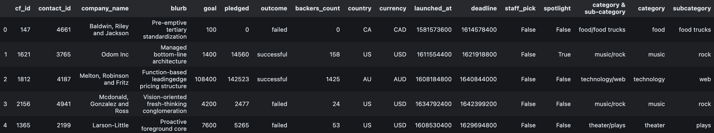
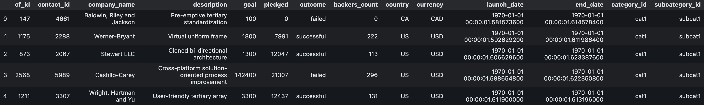

# Crowdfunding_ETL

Building an ETL pipeline using Python, Pandas, and dictionary methods/regular expressions to extract and transform the data.

After data is transformed, four CSV files are created and used to plot an entity relationship diagram and a table schema.  

### Create the Category and Subcategory DataFrames 

We begin with extracting and transforming the `crowdfunding.xlsx` Excel data to create two DataFrames:

A category DataFrame which contains category ids going from "cat1" to "catn" along with the unique category names.

A subcategory DataFrame which contains subcategory ids going from "subcat1" to "subcatn" along with the unique subcategory names.

We convert the DataFrames containing the data for the categories and subcategories into CSVs and reupload them.

### Create the Campaign DataFrame

This DataFrame requires us to modify the `crowdfunding.xlsx` Excel data. The initial format of the data appears as:

Certain columns are to be renamed only, while others are both renamed and converted to a different data format. Lastly, the campaign DataFrame is merged with the category and subcategory DataFrames. The DataFrames are merged on the corresponding columns 'category' and 'subcategory'. The columns 'staff_pick', 'spotlight', 'category & sub-category', 'category', and 'subcategory' are dropped from the final DataFrame.

The final campaign DataFrame resembles the following:

### Create the Contacts DataFrame

Choose one of the following two options for extracting and transforming the data from the  `contacts.xlsx.`

**Option 1:**  Use Python dictionary methods.  
    -   Import the  `contacts.xlsx`  file into a DataFrame.  
    -   Iterate through the DataFrame, converting each row to a dictionary.  
    -   Iterate through each dictionary by extracting the dictionary values and adding the values for each row to a new list.  
    -   Create a new DataFrame that contains the extracted data.  
    -   Split each "name" column value into a first and last name, and place each in a new column.  
    -   Clean and export the DataFrame as  `contacts.csv`  and save it to your GitHub repository.  

**Option 2:**  Use regular expression  
    -   Import the  `contacts.xlsx`  file into a DataFrame.  
    -   Extract the "contact_id," "name," and "email" columns by using regular expressions.  
    -   Create a new DataFrame with the extracted data.  
    -   Convert the "contact_id" column to the integer type.  
    -   Split each "name" column value into a first and a last name, and place each in a new column.  
    -   Clean and export the DataFrame as  `contacts.csv`  and save it to your GitHub repository.  

Final DataFrame should resemble:  

### Create the Crowdfunding Database:  

#### CSV Files:  
- `subcategory.csv` (Columns: subcategory_id, subcategory)  
- `contact_json.csv` (Columns: contact_id, first_name, last_name, email)  
- `category.csv` (Columns: category_id, category)  
- `campaign.csv` (Columns: cf_id, contact_id, company_name, description, goal, pledged, outcome, backers_count, country, currency, launch_date, end_date, category, subcategory)  

#### ERD Sketch:  

#### Create PostgreSQL Database:  
 - Create and Verify Tables  
	 - Execute the SQL schema file within the `crowdfunding_db` database in the correct order. Run `SELECT` statements for each table to verify if they have been created correctly.  
 - Import and Verify CSV File:  
	 - Import data from the CSV files into the corresponding tables. Run `SELECT` statements for each table to ensure the data is imported correctly.
